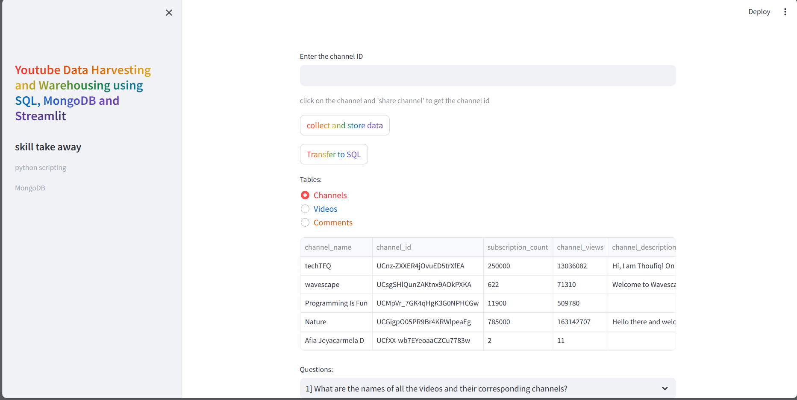
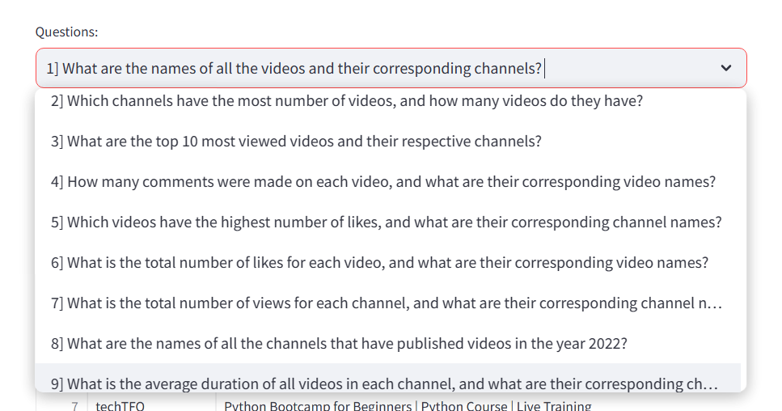
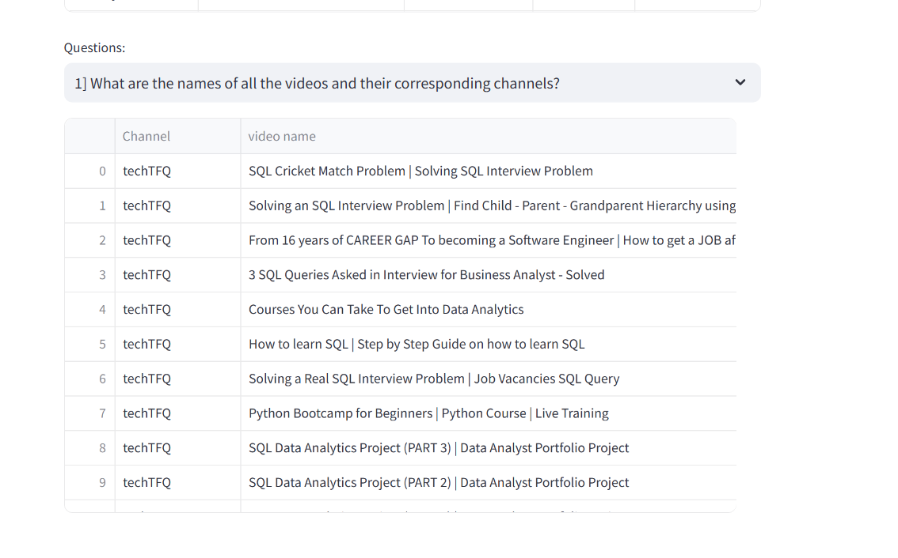

# YoutubeDataHarvesting
<header>Tools and libraries used:</header>
<body>
1.Pandas 
2.Streamlit 
3.pymongo  
4.psycopg2 
5.Google API Client 
6. MongoDB 
7. POSTGRESQL 
</body>

<h3>Queries</h3>

<h3>Output Table</h3>

